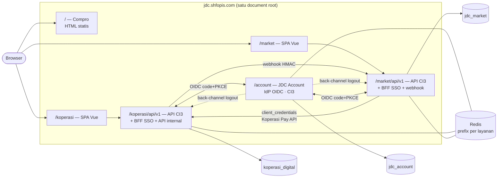
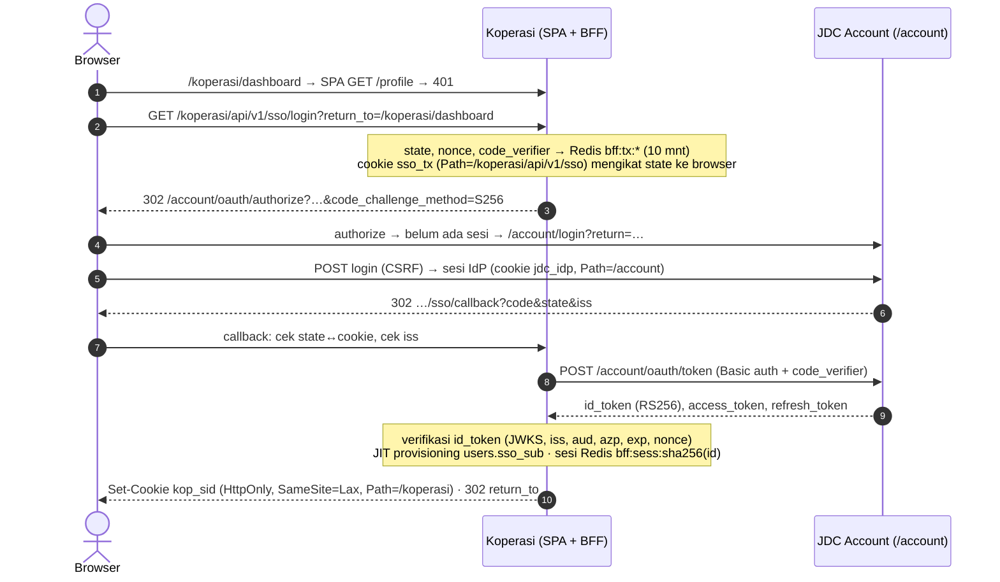
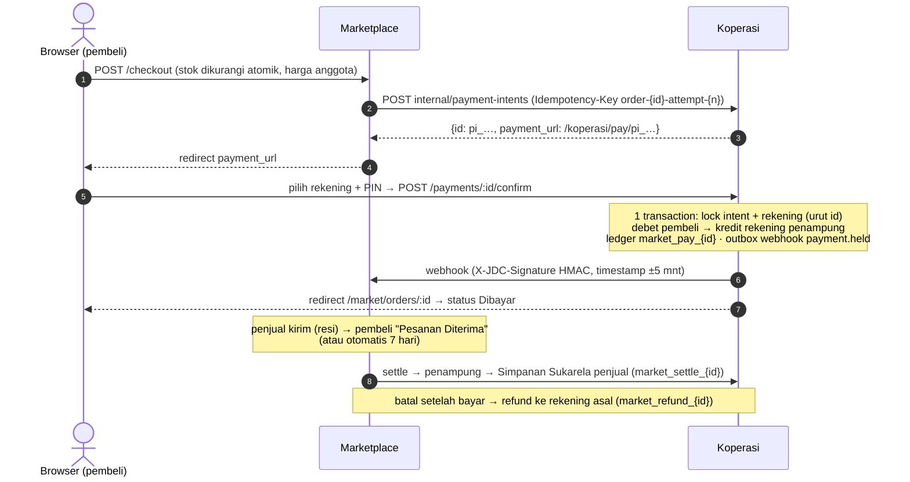

# Arsitektur SSO — Company Profile, Koperasi & Marketplace

> **Status (2026-09-17): diimplementasikan & teruji.**
> Saat `https://jdc.shfopis.com` dibuka, pengunjung masuk ke **company profile** dan memilih layanan —
> **Koperasi Digital** atau **Marketplace** — yang memakai **satu akun (SSO)** dan saling terintegrasi
> (pembayaran marketplace dari saldo simpanan koperasi).
>
> Hasil uji lokal (Apache + PHP 7.4 + MySQL 8 + Redis): `tests/sso_e2e_test.sh` **118/118**,
> `tests/smoke_test.sh` **72/72**, `tests/concurrency_test.sh` **11/11**, dan alur browser sungguhan
> (Chrome headless) compro → login → koperasi → SSO senyap ke market → checkout → Koperasi Pay → logout global **lulus**.

---

## 0. Ringkasan Keputusan

| Topik | Keputusan | Bagian |
|---|---|---|
| Topologi | **Satu domain, routing berbasis path**: `/` compro, `/account` IdP, `/koperasi` koperasi, `/market` marketplace | §2 |
| Pola SSO | **OpenID Connect Authorization Code + PKCE (S256 wajib)** dengan IdP sendiri: **JDC Account** | §3 |
| Token di browser | **Tidak ada.** Setiap layanan memakai pola **BFF**: backend menukar code, browser hanya pegang cookie sesi `HttpOnly` | §3.1 |
| Pemilik identitas | JDC Account (email, kata sandi, verifikasi email, blokir global). Role & data bisnis tetap milik tiap layanan | §3.6 |
| Integrasi antar layanan | API internal koperasi dengan token **client_credentials** + **Koperasi Pay** (tagihan → konfirmasi PIN di koperasi → dana ditahan → settle/refund) + webhook ber-HMAC | §4 |
| Stack backend | **CodeIgniter 3** untuk ketiga layanan (satu repo, kode bersama di `shared/`), kompatibel PHP 7.4 | §2.3 |
| Stack frontend | Vue 3 SPA (koperasi, market) + **Vite multi-page statis** (compro) + CSS Tailwind (halaman IdP server-rendered), satu npm workspace | §2.3 |
| User lama | ID & hash bcrypt dipindah apa adanya → **tidak perlu reset kata sandi**, cukup login ulang sekali | §7.3 |

### Perubahan dari rancangan awal (dan alasannya)

| Rancangan awal | Implementasi | Alasan |
|---|---|---|
| Subdomain per layanan (`account.jdc.`, `koperasi.jdc.`, …) | **Path** di `jdc.shfopis.com` | Permintaan client. Konsekuensi keamanan ditangani di §3.5 (cookie ber-`Path`, nama unik per layanan). |
| IdP & marketplace di Laravel (PHP 8.2+) | **CodeIgniter 3**, PHP 7.4-compatible | Hosting produksi saat ini PHP 7.4 (`composer.json` platform 7.4.33, transport Redis REST/Upstash menandakan shared hosting). Satu document root + satu `vendor/` + satu cara deploy; pola kode, logging, dan aturan buku besar koperasi dipakai ulang tanpa menambah framework kedua. |
| OIDC lewat paket pihak ketiga | **Authorization server ditulis sendiri** (`apps/account/libraries/Oauth_server.php`), profil sempit sesuai OAuth 2.0 Security BCP (RFC 9700) | `league/oauth2-server` terbaru butuh PHP 8. Profil yang didukung sengaja minimal (code+PKCE, refresh rotation, client_credentials) dan seluruhnya diuji (§10). |
| Compro Nuxt 3 static | **Vite multi-page** (HTML statis + Tailwind, ±1 KB JS) | Konten sedikit & statis; HTML murni sudah optimal untuk SEO tanpa runtime framework; satu toolchain dengan SPA. |
| Metode bayar marketplace: PG/transfer | **Koperasi Pay saja** (MVP) | Tidak ada PG terintegrasi; lihat `DOCS/ANALISIS_PAYMENT_GATEWAY.md`. Checkout menolak non-anggota dengan arahan aktivasi keanggotaan. |

---

## 1. Kondisi Sebelumnya

Satu aplikasi di root domain: `/api/v1/*` → CI3, sisanya SPA Vue yang langsung membuka `/login`.
Login lokal koperasi dengan JWT HS256 (TTL 24 jam) yang disimpan `js-cookie` (terbaca JavaScript),
registrasi otomatis membuka rekening wajib, dan belum ada marketplace.

Temuan yang ikut diperbaiki selama implementasi:

| Temuan | Dampak | Perbaikan |
|---|---|---|
| Dotenv v5 tidak memanggil `putenv()` → `getenv('APP_ENV')` selalu kosong | `ENVIRONMENT` selalu `development`, **`display_errors` menyala di produksi** | `shared/bootstrap.php` membaca `$_ENV`; default kini `production` |
| `404_override` menunjuk controller di subfolder | Route tak dikenal membalas halaman HTML CI3, bukan JSON | Controller `Notfound` dipindah ke root `controllers/` |
| `set_status_header()` CI3 hanya kenal daftar kode tetap | Kode di luar daftar (mis. 423) jadi **500 HTML** | `Api_response` selalu mengirim teks alasan |
| Hook CORS mengizinkan `FRONTEND_URL` (default `localhost:3000`) ber-credentials di produksi | Dengan auth berbasis cookie, origin itu bisa membaca data | CORS hanya aktif saat `development` |
| `router` memakai base `/koperasi-market/` sedangkan Vite `/` | Aset/rute rusak bergantung URL | Keduanya kini `/koperasi/` |

---

## 2. Arsitektur

### 2.1 Peta URL (satu domain)

| Path | Layanan | Disajikan oleh |
|---|---|---|
| `/`, `/tentang/`, `/kontak/`, `/syarat-ketentuan/`, `/kebijakan-privasi/` | **Company profile** + pilihan layanan | `public_html/compro/` (statis) |
| `/account/*` | **JDC Account** — login, daftar, OTP, lupa sandi, Akun Saya, admin platform, endpoint OIDC | `account.php` → `apps/account/` |
| `/koperasi/api/v1/*` | API Koperasi Digital (+ SSO BFF, API internal) | `index.php` → `application/` |
| `/koperasi/*` | SPA Koperasi Digital (termasuk `/koperasi/pay/:id`) | `public_html/koperasi/` |
| `/market/api/v1/*` | API Marketplace (+ SSO BFF, webhook) | `market.php` → `apps/market/` |
| `/market/*` | SPA Marketplace | `public_html/market/` |

Routing ada di `.htaccess` root. URL lama tetap berfungsi: `/api/v1/*` → **308** ke `/koperasi/api/v1/*`,
`/login` `/register` `/verify-otp` → **301** ke `/koperasi/dashboard`, `/dashboard/*` → `/koperasi/dashboard/*`.
Folder kode (`application`, `apps`, `shared`, `system`, `vendor`, `database`, …), dotfile, dan front controller
yang diakses langsung dijawab **403**.

### 2.2 Diagram komponen



### 2.3 Struktur repo

```
koperasi-market/                      ← document root produksi
├── .htaccess                         routing path + header keamanan + cache aset
├── index.php  account.php  market.php   front controller tiap layanan (tipis)
├── server.php                        router `php -S` untuk dev cepat
├── shared/                           kode bersama ketiga aplikasi CI3
│   ├── bootstrap.php                 front controller CI3 generik (+ perbaikan ENVIRONMENT)
│   ├── core/                         Base_model, Json_log, Request_guard, Sso_bff_controller
│   └── libraries/                    Oidc_client, Bff_session, Crypto, Http_client, Webhook_signature,
│                                     Redisx (prefix), Validator, Money, Api_response, Ratelimit
├── application/                      KOPERASI (CI3) — .env di root repo
├── apps/account/                     JDC ACCOUNT / IdP (CI3) — apps/account/.env, keys/
│   └── ui/                           build CSS Tailwind untuk view PHP
├── apps/market/                      MARKETPLACE (CI3) — apps/market/.env
├── database/migrations/              koperasi (006 SSO & keanggotaan, 007 Koperasi Pay)
├── database/account/  database/market/   skema DB layanan baru
├── packages/ui/                      @jdc/ui: preset Tailwind, components.css, AppLogo, AppSwitcher
├── compro/                           company profile (Vite MPA)
├── frontend/                         SPA koperasi (Vue 3)
├── market-frontend/                  SPA marketplace (Vue 3)
├── public_html/                      HASIL BUILD semua frontend (tidak di-commit)
└── tests/                            smoke, concurrency, sso_e2e + tests/lib/jdc.sh
```

### 2.4 Tanggung jawab tiap layanan

| Layanan | Bertanggung jawab atas | Tidak boleh |
|---|---|---|
| Compro | Konten publik, SEO (`sitemap.xml`, `robots.txt`, meta/OG, JSON-LD), pintu masuk layanan | Menyimpan data user |
| JDC Account | Kredensial, OTP email, reset sandi, sesi SSO, token, client OAuth, back-channel logout, audit, blokir global | Menyimpan saldo / role layanan |
| Koperasi | Keanggotaan & KYC, simpanan, pembiayaan, emas, PIN transaksi, **otoritas atas uang** (Koperasi Pay, rekening penampung) | Memverifikasi kata sandi |
| Marketplace | Toko, produk, keranjang, pesanan, status pengiriman, admin marketplace | Mengubah saldo langsung (wajib lewat API koperasi) |

---

## 3. Desain SSO (sebagaimana diimplementasikan)

### 3.1 Pola: OIDC + BFF

Backend tiap layanan adalah *confidential client*. Browser tidak pernah menerima access/refresh/ID token;
yang dipegang hanya cookie sesi acak `HttpOnly`. Refresh token disimpan **terenkripsi AES-256-GCM** di Redis.

### 3.2 Login pertama



### 3.3 Layanan kedua & SSO senyap

- Membuka `/market/…` yang butuh login → alur sama, **tanpa form** karena sesi IdP sudah ada.
- Halaman publik marketplace mencoba `prompt=none` **sekali per sesi browser** (`sessionStorage`): pengguna yang
  sudah login di koperasi otomatis tampil login di market; tamu kembali sebagai tamu (`login_required`).

### 3.4 Logout global & pencabutan

1. Tombol **Keluar dari Semua Layanan** (koperasi/market) → `POST …/sso/logout` (wajib header XHR) → sesi lokal dihapus,
   refresh token dicabut (RFC 7009), balasan `redirect_url` = `/account/oauth/logout?id_token_hint=…`.
2. IdP mengakhiri sesinya **hanya bila** `id_token_hint` sah dan `sid`-nya milik sesi browser itu; selain itu menampilkan
   halaman konfirmasi (mencegah logout-CSRF).
3. IdP mengirim **Back-Channel Logout** (`logout_token` RS256, `typ: logout+jwt`) ke setiap client yang pernah dimasuki
   sesi itu — outbox `backchannel_jobs`, dicoba langsung (timeout 3 dtk), gagal diulang cron dengan backoff.
4. Client memverifikasi `logout_token` (iss, aud, events, iat ≤ 5 mnt, tanpa nonce, **jti sekali pakai**) lalu menghapus
   semua sesi lokal ber-`sid` itu (indeks Redis `bff:sid:*`).

Jaring pengaman: sesi BFF merotasi refresh token begitu access token (15 mnt) lewat. Sesi IdP yang dicabut, user
diblokir, atau kata sandi direset membuat refresh ditolak → sesi lokal mati **≤ 15 menit** walau back-channel gagal.
Refresh dari request paralel dikunci per sesi (`SET NX`), dan IdP memberi jendela 30 dtk agar balapan tidak dianggap
pencurian.

### 3.5 Spesifikasi token, sesi & cookie

| Item | Nilai |
|---|---|
| Tanda tangan | RS256, `kid` = thumbprint RFC 7638; semua kunci di `OIDC_KEYS_DIR` dipublikasikan di JWKS, yang terbaru menandatangani |
| Discovery / JWKS | `/account/.well-known/openid-configuration`, `/account/.well-known/jwks.json` (di-cache client 1 jam; `kid` asing → ambil ulang sekali) |
| Authorization code | 256 bit, disimpan SHA-256, TTL 60 dtk, sekali pakai; dipakai ulang → token turunannya dicabut |
| `id_token` | 10 mnt; `iss sub aud azp iat exp auth_time nonce sid name email email_verified` |
| `access_token` | 15 mnt; `token_use=user` (aud = client) atau `token_use=service` (aud = `koperasi`, client_credentials) |
| `refresh_token` | 30 hari, **rotasi setiap dipakai**, reuse di luar jendela 30 dtk → **seluruh keluarga dicabut** + audit |
| Sesi IdP | Cookie `jdc_idp`, `Path=/account`; idle 2 jam, absolut 12 jam, "Ingat saya" 30 hari; DB menyimpan SHA-256 |
| Sesi koperasi | Cookie `kop_sid`, `Path=/koperasi`; idle **30 mnt**, absolut **8 jam** |
| Sesi marketplace | Cookie `mkt_sid`, `Path=/market`; idle 7 hari, absolut 30 hari |
| Flag cookie | `HttpOnly; SameSite=Lax; Secure` (+ prefix `__Secure-` saat `COOKIE_SECURE=true`). `__Host-` tidak dipakai karena mensyaratkan `Path=/` |

**Konsekuensi satu origin (path-based).** Browser memperlakukan `/account`, `/koperasi`, `/market` sebagai origin
yang sama, jadi celah XSS di satu layanan berpotensi menyentuh layanan lain. Mitigasi yang dipasang:
cookie `HttpOnly` + `Path` terpisah, tidak ada token di JavaScript, **CSP ketat** (`script-src 'self'`, tanpa inline
script; halaman IdP juga tanpa `unsafe-inline` style), `X-Frame-Options: DENY`, header `X-Requested-With` + `Sec-Fetch-Site`
wajib untuk request ber-cookie yang mengubah data, dan `image_url` produk hanya `https://`. Bila kelak memungkinkan,
subdomain terpisah memberi isolasi lebih kuat — seluruh URL sudah dari `APP_URL`, jadi migrasi cukup konfigurasi
+ `.htaccess`.

### 3.6 Kepemilikan data & keanggotaan

```
jdc_account.users            koperasi_digital.users                 jdc_market.customers
─────────────────            ──────────────────────                 ────────────────────
id (= sub)  ───────────────▶ sso_sub (UNIQUE)                ◀───── sso_sub (UNIQUE)
name, email, email_verified  role, status lokal, member_since       role customer/admin, status
password_hash (bcrypt 12)    pin_hash (+ counter & kunci)           toko, pesanan
status active/banned         KYC, rekening, pembiayaan, emas
is_platform_admin
```

- **JIT provisioning** hanya lewat `sso_sub`. Baris lama dengan email sama yang belum ditautkan **tidak** diambil alih
  otomatis (jalan pintas pembajakan akun) → halaman error `account_link_conflict`.
- **Punya Akun JDC ≠ anggota koperasi.** Rekening wajib dibuka saat **Aktivasi Keanggotaan** (butuh KYC lengkap),
  bukan saat daftar. Endpoint simpanan/pembiayaan/emas/Koperasi Pay membalas `403 MEMBERSHIP_REQUIRED` untuk non-anggota;
  profil, KYC, notifikasi, PIN, dan aktivasi tetap bisa dipakai.
- Role tidak ada di token: pengurus/admin koperasi di `koperasi_digital.users.role`, admin marketplace di
  `jdc_market.customers.role`, admin platform (blokir global) di `jdc_account.users.is_platform_admin`.

### 3.7 Pengamanan halaman JDC Account

- CSRF double-submit cookie (`SameSite=Strict`) + cek `Origin`/`Sec-Fetch-Site` pada semua form.
- Login: hash dummy untuk email tak dikenal, **kunci 15 menit setelah 5 gagal per email** (dihitung dari `audit_logs`),
  rate limit per IP, `password_needs_rehash`.
- OTP 6 digit disimpan HMAC (`APP_KEY`), **maks 5 percobaan**, TTL 15 menit; kirim ulang generik.
- Registrasi ulang email yang belum terverifikasi menimpa kata sandi (yang lolos OTP yang menentukan) — mencegah
  "memesan" email orang lain.
- Kebijakan sandi: min 8, maks 72 byte (batas bcrypt), tolak sandi umum & yang memuat alamat email.
- Reset sandi: token 256 bit sekali pakai (1 jam), mencabut **semua** sesi + back-channel, email pemberitahuan.
- Step-up: ubah PIN transaksi di koperasi mensyaratkan login ≤ 10 menit (`prompt=login` → `auth_time`).
- Halaman "Akun Saya": ubah nama & sandi, daftar perangkat aktif + keluarkan satu per satu.

---

## 4. Integrasi Koperasi ↔ Marketplace

### 4.1 API internal koperasi

Hanya menerima access token `client_credentials` dengan `aud=koperasi` dan `token_use=service`
(`Internal_Controller`); cookie sesi pengguna ditolak.

| Method | Path (`/koperasi/api/v1/internal`) | Scope |
|---|---|---|
| GET | `/members/:sub` → `{linked, is_member, kyc_completed, status}` (tanpa NIK/saldo) | `koperasi.members.read` |
| POST | `/payment-intents` (header **`Idempotency-Key`** wajib, `amount` string desimal) | `koperasi.payments.write` |
| GET | `/payment-intents/:id` | 〃 |
| POST | `/payment-intents/:id/settle` · `/refund` · `/cancel` (idempoten) | 〃 |

### 4.2 Alur Koperasi Pay



Aturan yang dijaga:

- Saldo hanya berubah di transaction dengan `SELECT … FOR UPDATE`, update relatif, validasi setelah terkunci;
  rekening dikunci berurutan id agar tidak deadlock. Dua konfirmasi bersamaan → tepat satu debet (teruji).
- Hanya rekening **non-wajib & non-sistem** yang boleh dipakai membayar. Produk sistem
  "Rekening Penampung Marketplace" (`is_system=1`, milik user sistem tanpa kredensial) tidak terlihat anggota.
- PIN transaksi: bcrypt, 5 kali salah → terkunci 30 menit; tolak PIN berulang/berurutan.
- Status intent: `requires_confirmation` → `held` → `settled`/`refunded`; `cancelled`/`expired` (30 menit).
- **Outbox**: event webhook ditulis dalam transaction yang sama dengan perubahan status; retry backoff maks 12 kali.
  Marketplace mendeduplikasi per `event_id` dan tetap **merekonsiliasi** status saat halaman pesanan dibuka & via cron.
- Marketplace menulis niat pencairan (`payout_action/payout_status`) **sebelum** memanggil koperasi; gagal jaringan
  diulang cron, penolakan definitif ditandai `failed` untuk ditinjau admin.
- `php index.php cli/ledger_audit run` kini juga memeriksa **saldo rekening penampung = total intent `held`**.

> **Syariah:** akad rekening penampung dan skema biaya layanan marketplace (saat ini tanpa biaya) wajib dikonfirmasi
> Dewan Pengawas Syariah sebelum go-live.

---

## 5. Peta Endpoint

### JDC Account (`/account`)

| Method | Path | Keterangan |
|---|---|---|
| GET | `/account` | Akun Saya (layanan, profil, sandi, perangkat) |
| GET/POST | `/login` · `/register` · `/verify-email` · `/forgot-password` · `/reset-password` | Form HTML ber-CSRF |
| POST | `/logout` · `/resend-otp` · `/profile` · `/password` · `/sessions/revoke` | |
| GET | `/.well-known/openid-configuration` · `/.well-known/jwks.json` | Publik, `Access-Control-Allow-Origin: *` |
| GET | `/oauth/authorize` | code + PKCE S256, `prompt=none|login`, `max_age` |
| POST | `/oauth/token` | `authorization_code`, `refresh_token`, `client_credentials` |
| GET/POST | `/oauth/userinfo` · POST `/oauth/revoke` · GET/POST `/oauth/logout` | |
| GET / POST | `/admin/users` · `/admin/users/:id/status` | Admin platform: cari & blokir/pulihkan |
| GET | `/health` | DB, Redis, kunci penandatangan |

### Koperasi — tambahan (`/koperasi/api/v1`)

| Method | Path | Guard |
|---|---|---|
| GET | `/sso/login` · `/sso/callback` | publik |
| POST | `/sso/logout` (XHR) · `/sso/backchannel-logout` (server IdP) | |
| GET · POST | `/membership` · `/membership/activate` | sesi (non-anggota boleh) |
| GET · PUT | `/security/pin` (PUT butuh login ≤ 10 mnt) | sesi (non-anggota boleh) |
| GET · POST | `/payments/:id` · `/payments/:id/confirm` · `/payments/:id/cancel` | sesi + anggota |
| — | `/internal/*` | token layanan (§4.1) |
| 410 | `/login` `/register` `/verify-email` `/resend-otp` `/logout` | saat `AUTH_MODE=sso` |

Endpoint lama (simpanan, pembiayaan, emas, notifikasi, admin) tidak berubah selain prefix `/koperasi`.

### Marketplace (`/market/api/v1`)

| Method | Path | Guard |
|---|---|---|
| GET | `/health` · `/products?q=&store=&page=` · `/products/:id` · `/stores/:slug` | publik |
| GET/POST | `/sso/login` · `/sso/callback` · `/sso/logout` · `/sso/backchannel-logout` | |
| GET | `/me` (profil + status keanggotaan + toko + jumlah keranjang) | sesi |
| GET · PUT · DELETE | `/cart` · `/cart/items` · `/cart/items/:product_id` | sesi |
| POST | `/checkout` | sesi (Koperasi Pay → anggota) |
| GET · POST | `/orders` · `/orders/:id` · `/orders/:id/pay` · `/orders/:id/cancel` · `/orders/:id/complete` | sesi, milik sendiri |
| GET/POST/PUT | `/seller/store` · `/seller/products[/:id]` · `/seller/orders` · `/seller/orders/:id/ship` · `/seller/orders/:id/cancel` | sesi; buka toko = anggota ber-KYC |
| POST | `/webhooks/koperasi` | HMAC |
| GET · PUT | `/admin/stores` · `/admin/stores/:id/status` · `/admin/orders` | admin marketplace |

---

## 6. Menjalankan Lokal

Prasyarat: PHP 7.4+ (`bcmath mysqli openssl curl mbstring json`), Composer 2, MySQL 8, Redis 5+, Node 18+,
Apache dengan `mod_rewrite` + `mod_headers` (Laragon) yang document root-nya folder repo ini.

```bash
composer install
npm install                                   # satu workspace untuk semua frontend

# .env ketiga layanan
cp .env.example .env
cp apps/account/.env.example apps/account/.env
cp apps/market/.env.example apps/market/.env
#  → APP_ENV=development, APP_URL=http://<origin>, COOKIE_SECURE=false (tanpa HTTPS),
#    secret client identik di pasangan .env (lihat komentar di tiap .env.example),
#    REDIS_PREFIX berbeda per layanan, RATE_LIMIT_SCALE=50 bila menjalankan tests/*.sh

# database
mysql -u root -e "CREATE DATABASE jdc_account CHARACTER SET utf8mb4 COLLATE utf8mb4_unicode_ci;"
mysql -u root -e "CREATE DATABASE jdc_market  CHARACTER SET utf8mb4 COLLATE utf8mb4_unicode_ci;"
mysql -u root jdc_account      < database/account/001_schema.sql
mysql -u root jdc_market       < database/market/001_schema.sql
mysql -u root koperasi_digital < database/migrations/006_sso_membership.sql
mysql -u root koperasi_digital < database/migrations/007_payment_intents.sql

php account.php cli/keys generate
php account.php cli/clients sync
php account.php cli/users migrate --dry-run && php account.php cli/users migrate
php index.php  cli/sso link_users

npm run build                                  # compro, CSS account, SPA koperasi & market → public_html/
```

Pengembangan frontend dengan hot reload: `npm run dev:koperasi` (5173), `npm run dev:market` (5174),
`npm run dev:compro` (5175). Vite memproksikan `/koperasi/api`, `/market/api`, `/account` ke backend
(`VITE_BACKEND_URL`, default `http://127.0.0.1:8300`). Karena redirect SSO memakai `APP_URL`, cara paling
sederhana adalah `npm run build` lalu buka lewat Apache. `php -S 127.0.0.1:8300 server.php` juga bisa,
tetapi back-channel logout & webhook akan timeout (server single-thread memanggil dirinya sendiri).

---

## 7. Deploy Produksi (jdc.shfopis.com)

### 7.1 Persiapan (sekali)

1. **PHP** 7.4+ dengan ekstensi di §6; **HTTPS aktif** (wajib: cookie `Secure`).
2. **Tiga database + user terpisah** dengan hak minimal: `koperasi_digital` (sudah ada), `jdc_account`, `jdc_market`.
3. **Redis**: satu instance boleh dipakai bersama, `REDIS_PREFIX` beda per layanan (`""` koperasi, `idp:`, `mkt:`).
   Upstash REST didukung (`REDIS_TRANSPORT=rest`).
4. **SMTP** di `apps/account/.env` (OTP & reset sandi). Tanpa SMTP, email hanya tertulis di log.
5. **Secret** (jangan dipakai ulang antar lingkungan):

| Variabel | Di file | Pasangan |
|---|---|---|
| `APP_KEY` | apps/account/.env | — (`php -r "echo bin2hex(random_bytes(32));"`) |
| `CLIENT_KOPERASI_SECRET` | apps/account/.env | `SSO_CLIENT_SECRET` di `.env` |
| `CLIENT_MARKET_SECRET` | apps/account/.env | `SSO_CLIENT_SECRET` di apps/market/.env |
| `CLIENT_MARKET_SERVER_SECRET` | apps/account/.env | `SERVICE_CLIENT_SECRET` di apps/market/.env |
| `MARKET_WEBHOOK_SECRET` | `.env` | `KOPERASI_WEBHOOK_SECRET` di apps/market/.env |
| `SESSION_ENC_KEY` | `.env` dan apps/market/.env (nilai **berbeda**) | — (`base64_encode(random_bytes(32))`) |

   Secret client dibuat dengan `php account.php cli/clients secret`.
6. **Kunci penandatangan** di luar document root: `OIDC_KEYS_DIR=/home/<user>/jdc-keys/`, lalu
   `php account.php cli/keys generate` (izin file 0600).

### 7.2 Build & unggah

```bash
composer install --no-dev --optimize-autoloader
npm ci && npm run build        # di mesin build/CI; unggah folder public_html/ hasilnya
```

Unggah seluruh repo (tanpa `node_modules`, `.env` lokal, `apps/account/keys`) ke document root yang sama seperti
sekarang. `.htaccess` mengasumsikan `DOCUMENT_ROOT` = folder repo.

### 7.3 Cutover (jendela maintenance)

1. **Backup** ketiga database.
2. Migrasi koperasi: `006_sso_membership.sql`, `007_payment_intents.sql`. Impor skema `jdc_account` & `jdc_market`.
3. `php account.php cli/clients sync`
4. `php account.php cli/users migrate --dry-run` → periksa `konflik=0` → `php account.php cli/users migrate`
   (mempertahankan id & hash bcrypt; status `banned` ikut jadi blokir global; `super_admin` jadi admin platform;
   `AUTO_INCREMENT` IdP digeser di atas id lama).
5. `php index.php cli/sso link_users` (menautkan `sso_sub = id`).
6. `.env` koperasi: `AUTH_MODE=sso`, `APP_ENV=production`, `COOKIE_SECURE=true`.
7. Verifikasi: `/account/health`, `/koperasi/api/v1/health`, `/market/api/v1/health` = `ok`; login dengan akun lama;
   buka Marketplace tanpa login ulang; logout global.
8. Promosikan admin marketplace setelah yang bersangkutan pernah login ke market:
   `php market.php cli/admin promote <email>`.

**Rollback:** pulihkan backup, kembalikan kode lama. Kolom `password_hash` koperasi tidak dihapus migrasi, jadi
`AUTH_MODE=legacy` juga masih bisa dipakai sebagai jalan mundur cepat. Setelah ≥ 2 minggu stabil: hapus
`application/controllers/api/v1/Auth.php`, `Jwt_service`, jalur Bearer di `MY_Controller`, dan kosongkan
`users.password_hash` koperasi.

### 7.4 Cron

```cron
* * * * *   php /path/account.php cli/maintenance run      # retry back-channel logout, purge token (per jam)
* * * * *   php /path/index.php  cli/webhooks run          # retry webhook Koperasi Pay, kedaluwarsakan tagihan
*/5 * * * * php /path/market.php cli/orders maintenance    # rekonsiliasi bayar, batal 24 jam, selesai 7 hari, retry payout
0 2 * * *   php /path/index.php  cli/ledger_audit run      # exit 1 = anomali → alert
# (sudah ada) worker & recover emas — lihat README
```

---

## 8. Operasional

| Tugas | Cara |
|---|---|
| Tambah/ubah client OIDC | Edit `apps/account/config/clients.php` (redirect URI persis, tanpa wildcard) → isi secret di `.env` → `cli/clients sync` |
| Rotasi kunci | `cli/keys generate` → tunggu > 15 menit (TTL token terpanjang) → hapus file PEM lama |
| Rotasi secret client | Ganti di kedua `.env` bersamaan → `cli/clients sync` |
| Admin platform | `php account.php cli/users promote <email>` → `/account/admin/users` |
| Blokir akun | `/account/admin/users` → Blokir (cabut semua sesi + back-channel ke semua layanan) |
| Pindah ke domain sendiri | Ubah `APP_URL` & `SSO_ISSUER` di ketiga `.env`, `cli/clients sync`, perbarui `compro/public/sitemap.xml`, `robots.txt`, `<link rel=canonical>` compro, lalu build ulang |
| Pantau | `audit_logs` (login_failed, refresh_token_reuse, auth_code_reuse, client_auth_failed), `backchannel_jobs.failed_at`, `webhook_deliveries.failed_at`, `orders.payout_status='failed'`, exit code `ledger_audit`, log JSON per layanan (`service` field) |

---

## 9. Checklist Keamanan

| Kontrol | Status |
|---|---|
| PKCE S256 wajib, redirect URI persis, state & nonce wajib, `iss` di respons (RFC 9207) | ✅ teruji |
| Code sekali pakai (reuse mencabut token), refresh rotation + deteksi reuse | ✅ teruji |
| Kredensial (sesi, code, refresh, OTP, token reset, secret client) disimpan hash/HMAC | ✅ |
| Rate limit per IP + kunci login per email + batas percobaan OTP & PIN | ✅ teruji |
| Anti-enumerasi (login, kirim ulang OTP, lupa sandi) | ✅ teruji |
| CSRF: form IdP (double-submit), API ber-cookie (`X-Requested-With` + `Sec-Fetch-Site`) | ✅ teruji |
| Open redirect: `return_to`/`return` hanya path di bawah prefix layanan | ✅ teruji |
| Cookie `HttpOnly`, `Secure` (prod), `SameSite`, `Path` per layanan; tidak ada token di JS | ✅ teruji |
| CSP, `X-Frame-Options`, `nosniff`, `Referrer-Policy`, HSTS (HTTPS), `Cache-Control: no-store` untuk respons auth | ✅ |
| Verifikasi `id_token` & `logout_token` lengkap, replay `jti` ditolak | ✅ |
| Token layanan terpisah (`token_use`, `aud`, scope), API internal menolak token pengguna | ✅ teruji |
| Idempotency, row locking, outbox webhook, HMAC + timestamp, dedup event | ✅ teruji |
| `display_errors` mati di produksi (perbaikan ENVIRONMENT) | ✅ |
| Kunci privat di luar web root & file sensitif diblokir `.htaccess` | ✅ teruji (lokal) — pastikan `OIDC_KEYS_DIR` di produksi |
| Pentest pihak ketiga IdP & Koperasi Pay | ⚠ belum — wajib sebelum go-live |
| Review Dewan Pengawas Syariah (rekening penampung, biaya) & penasihat hukum (syarat, privasi, UU PDP) | ⚠ belum |
| 2FA/TOTP untuk admin platform & pengurus | ⚠ rekomendasi lanjutan |

---

## 10. Pengujian

| Suite | Cakupan | Perintah |
|---|---|---|
| `tests/sso_e2e_test.sh` (118) | Routing & pemblokiran file; protokol OIDC (PKCE, reuse code/refresh, client auth, client_credentials, userinfo); keamanan form IdP (CSRF, sandi lemah, kunci login, batas OTP); SSO BFF (cookie, CSRF API, keanggotaan, SSO senyap, open redirect, state palsu, refresh otomatis, back-channel, RP logout, reset sandi, blokir admin); Koperasi Pay & marketplace (syarat penjual, harga anggota, stok, idempotensi, konfirmasi bersamaan, settle, refund, batal, saldo kurang, PIN terkunci, webhook HMAC/replay) & audit buku besar | `bash tests/sso_e2e_test.sh` |
| `tests/smoke_test.sh` (72) | Seluruh fitur koperasi lama lewat sesi SSO + aktivasi keanggotaan | `bash tests/smoke_test.sh` |
| `tests/concurrency_test.sh` (11) | Row locking setoran, angsuran, beli & jual emas | `bash tests/concurrency_test.sh` |
| Type-check | `vue-tsc` SPA koperasi & market | `npm run type-check` |

Variabel yang bisa diatur: `ORIGIN`, `PHP_BIN`, `MYSQL_BIN`, `REDIS_CLI`, `OPENSSL`. Suite membuat data uji
(akun `*@mail.com` ber-timestamp) di database yang dituju — **jangan dijalankan ke produksi**.

---

## 11. Keputusan Bisnis yang Diambil (dapat diubah)

Diambil tanpa konfirmasi client sesuai instruksi; semuanya ada di konfigurasi/kode yang jelas letaknya.

| Keputusan | Nilai saat ini | Lokasi |
|---|---|---|
| Keanggotaan terpisah dari akun, butuh KYC | Ya | `Membership.php` |
| Penjual | Hanya anggota aktif ber-KYC, 1 akun = 1 toko | `Seller.php` |
| Pembeli & pembayaran | Katalog publik; checkout hanya Koperasi Pay → anggota | `Order_service::assert_can_pay` |
| Harga anggota | Opsional per produk, berlaku saat checkout | `Order_model::create_from_cart` |
| Checkout | Per toko; ongkir disepakati di luar sistem (`shipping_fee = 0`) | `CheckoutView.vue` |
| Dana penjualan | Masuk Simpanan Sukarela penjual (dibuka otomatis bila belum ada) | `config/koperasi.php` `payee_product_name` |
| Batas waktu | Tagihan 30 mnt · pesanan tak dibayar batal 24 jam · selesai otomatis 7 hari setelah dikirim | `config/koperasi.php`, `apps/market/config/market.php` |
| Batas nominal Koperasi Pay | Rp 50.000.000 per transaksi | `PAYMENT_MAX_AMOUNT` |
| Biaya layanan marketplace | Tidak ada | — |
| Sesi | IdP 2 jam idle / 12 jam, koperasi 30 mnt / 8 jam, market 7 / 30 hari | `.env` |

### Konten yang wajib diisi pengurus sebelum publikasi

Ditandai `[… — diisi pengurus]` (latar kuning) di compro: visi & misi, legalitas (badan hukum/NIB), susunan pengurus
& DPS, alamat/email/telepon/jam layanan. Halaman **Syarat & Ketentuan** dan **Kebijakan Privasi** berstatus **DRAF**.

---

## 12. Rekomendasi Lanjutan

1. Payment gateway sebagai metode bayar kedua untuk non-anggota (`DOCS/ANALISIS_PAYMENT_GATEWAY.md`).
2. Unggah gambar produk ke penyimpanan objek (saat ini URL `https://` eksternal) dan integrasi ongkir kurir.
3. 2FA (TOTP) di JDC Account untuk admin & pengurus; alur ganti email dengan verifikasi ganda.
4. Notifikasi email untuk penjual (pesanan baru) & pembeli (dikirim/dibatalkan).
5. CMS ringan untuk konten compro bila pengurus perlu mengubah sendiri.
6. Subdomain per layanan bila hosting memungkinkan (isolasi origin, §3.5).
7. Naik ke PHP 8.x (`firebase/php-jwt` 7, CI4/Laravel jangka panjang) — kode baru sudah kompatibel PHP 8.
